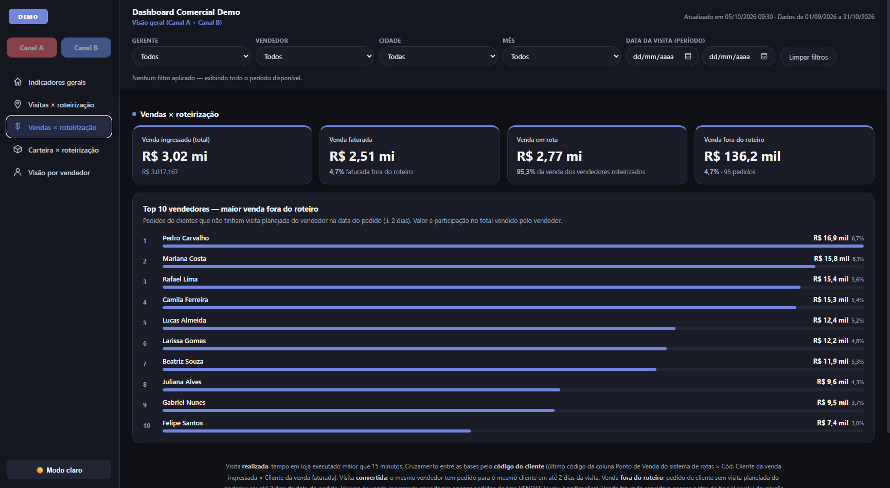
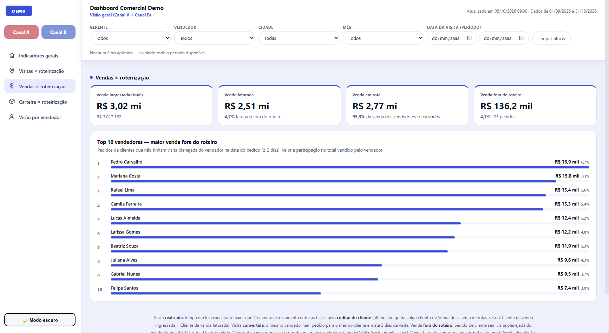

# 📊 Dashboard Comercial — Rotas & Vendas

Dashboard web interativo desenvolvido para simular o acompanhamento de uma operação comercial, reunindo indicadores de **roteirização, visitas, vendas e cobertura de clientes** em uma única interface.

🌐 **[Acessar demonstração online](https://marianasantos-dev.github.io/sales-route-dashboard/)**

> **Projeto demonstrativo:** todos os nomes, clientes, vendedores, valores e indicadores utilizados são **100% fictícios**. Nenhuma informação corporativa real está presente neste repositório.

---

## 🖥️ Preview

### 🌙 Modo escuro



### ☀️ Modo claro



---

## 💡 Sobre o projeto

O projeto foi desenvolvido com o objetivo de transformar dados de uma operação comercial em uma interface web interativa e de fácil consulta.

O dashboard permite acompanhar diferentes aspectos da operação, desde o planejamento e realização de visitas até indicadores de vendas e cobertura da carteira de clientes.

A aplicação foi construída para funcionar diretamente no navegador, sem necessidade de backend ou instalação de dependências.

---

## ⚙️ Funcionalidades

- Filtros por canal, gerente, vendedor, cidade, mês e período
- Indicadores de visitas planejadas e realizadas
- Análise de visitas não realizadas e suas justificativas
- Conversão de visitas em vendas
- Tempo médio de permanência
- Comparação entre vendas em rota e fora do roteiro
- Acompanhamento da carteira e cobertura de clientes
- Rankings e tabelas interativas
- Navegação entre diferentes análises
- Alternância entre tema claro e escuro
- Atualização dinâmica dos indicadores conforme os filtros

---

## 🛠️ Tecnologias utilizadas

- **HTML5** — estrutura da aplicação
- **CSS3** — layout, responsividade e temas
- **JavaScript** — filtros, interações e atualização dinâmica dos dados
- **Git & GitHub** — versionamento e publicação do projeto
- **GitHub Pages** — hospedagem da aplicação

---

## 📂 Dados

A versão pública utiliza uma **base de dados sintética**, criada especificamente para este projeto.

Ela simula uma operação comercial com:

- dois canais de atendimento;
- diferentes vendedores e gestores;
- clientes distribuídos entre cidades;
- visitas planejadas e realizadas;
- vendas em rota e fora do roteiro;
- motivos de não realização de visitas.

Essa abordagem permite demonstrar as funcionalidades da aplicação sem expor informações reais ou confidenciais.

---

## 🤖 Processo de desenvolvimento

O projeto faz parte dos meus estudos e da minha evolução em **desenvolvimento de software**, aplicando conhecimentos de programação a um cenário próximo de problemas encontrados em ambientes corporativos.

Ferramentas de Inteligência Artificial, incluindo **Claude**, foram utilizadas como apoio durante etapas de prototipação, desenvolvimento e revisão do projeto.

---

## 🚀 Executar localmente

Clone o repositório:

```bash
git clone https://github.com/Marianasantos-dev/sales-route-dashboard.git
